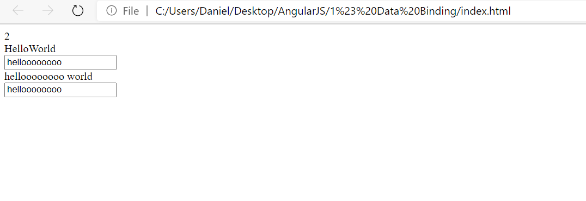
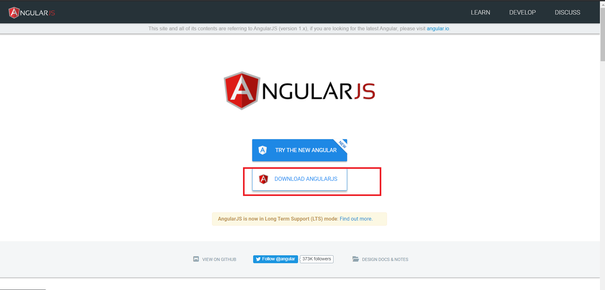
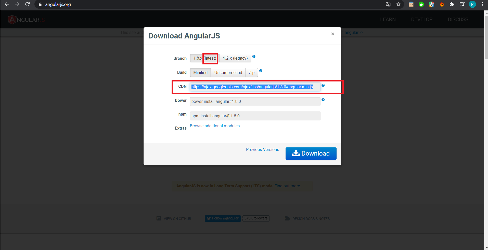
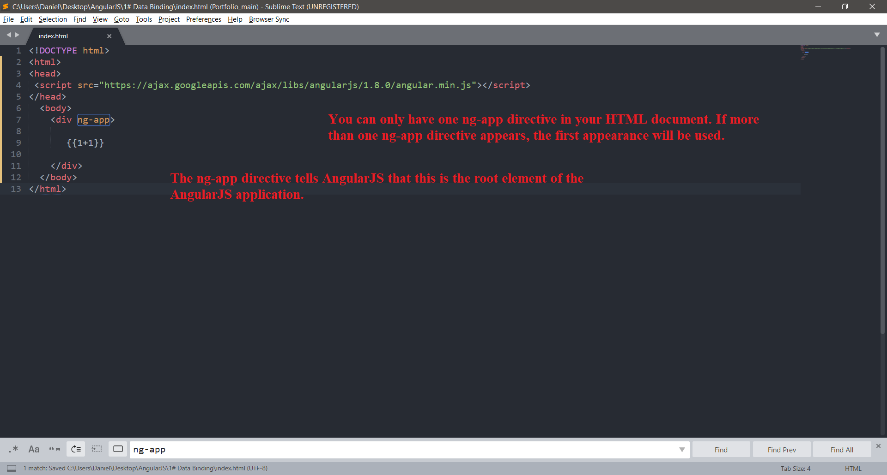

# Date binding
Date binding is one of the strengths of AngularJS. 
It allows you to bind a template to application data using
 {{double curly braces}}
In this part, I'll write hello world in AngularJS.


Дата биндинг это одна из сильных сторон AngularJS. 
Он позволяет связывать шаблон с данными приложения с помощью
{{двойных фигурных скобок}}.

# General


 ```html
<!DOCTYPE html>
<html>
<head>
 <script src="https://ajax.googleapis.com/ajax/libs/angularjs/1.8.0/angular.min.js"></script>
</head>
  <body>
    <div ng-app>

   	   {{1+1}} <br>
   	   {{"Hello" + "World"}} <br>
   	   	<!--ng-model ir jame kintamasis kuris bus subindintas(priristas)-->
   	   		<!--Two-way Binding-->
   	   <input type="text" ng-model="hello"> <br> 	<!--0000000 -> pats prirasiau -->

   	    {{hello + " world"}} <br>
   	    
				<!--Vienkartinumas-->
   	    <input type="text" ng-model="hello"> <br>

    </div>
  </body>
</html>
```


# Download

 
 
  
  
   
