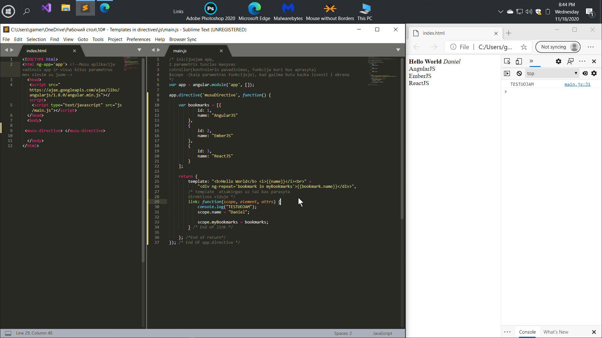

# Templates in directives
  
Very often in an application, we want to encapsulate a piece of template with 
some kind of logic, in order to reuse it later. Directives with their
 templates and link functions will help us with this.

Очень часто в приложении нам хочется инкапсулировать кусок шаблона (takzhe kusochek KODA HTMl (<b>text</b>...))
с какой-то логикой, для того, чтобы его потом повторно использовать.
В этом нам помогут директивы с их шаблонами и линк функцией.

# General

