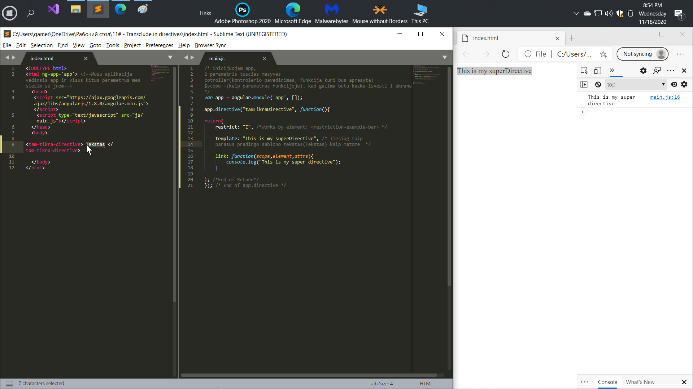
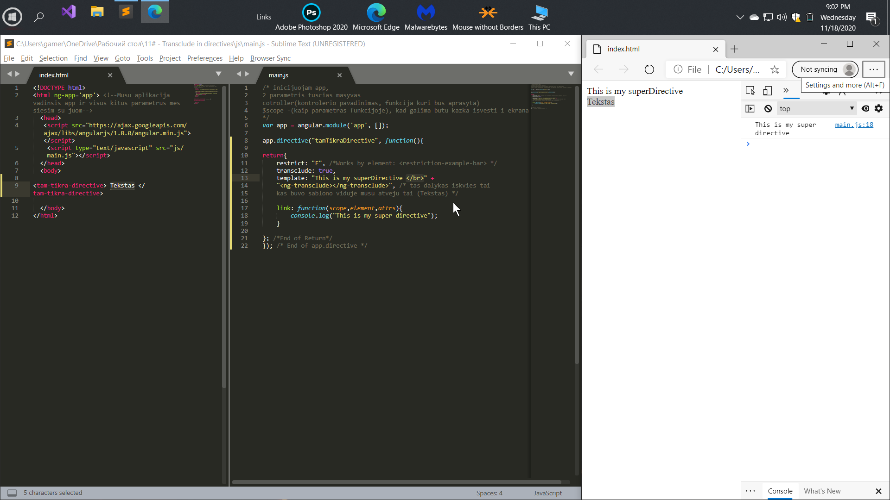
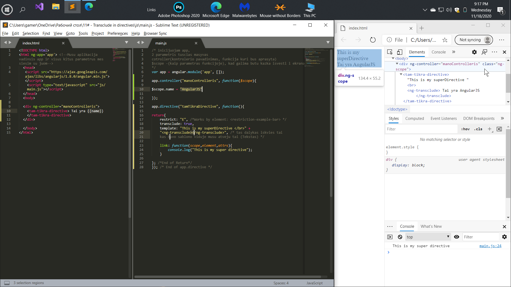
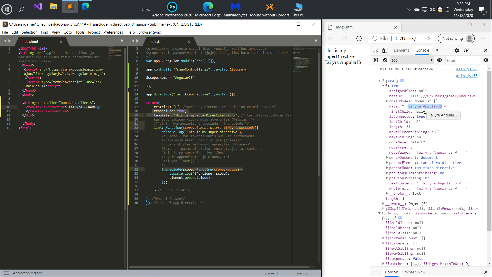

# Transclude in directives
  
Transclude is the ability to use the original directive content anywhere
in our template.We will learn how to do this 
using both the ng-transclude tag and the transclude function.

Transclude - это возможность использовать первоначальное
содержимое директивы в любом месте нашего шаблона.
с помощью тега ng-transclude,
и с помощью функции transclude.

# General

## Direktivos tekstas nera matomas...

## Transclude pajungimas su ng-transclude direktiva

