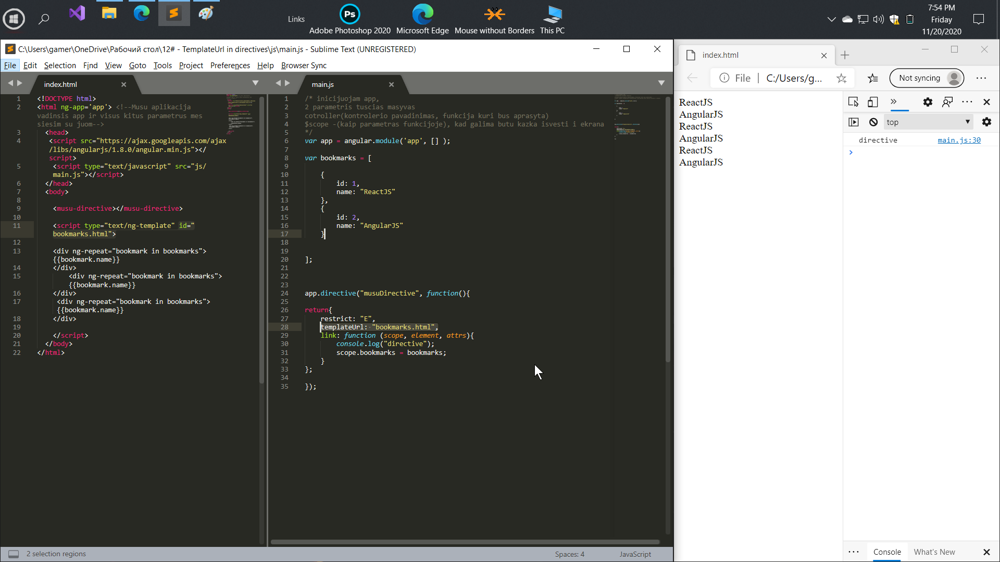

# TemplateUrl in directives
  
When the template in a directive gets large, it is difficult to maintain. 
We can replace the template variable with templateUrl, which allows us 
to specify which template to load.

Когда шаблон в директиве становится большим - его трудно поддерживать. 
Мы можем заменить переменную шаблона на templateUrl, которая позволяет указывать
 какой шаблон загружать.

# General

