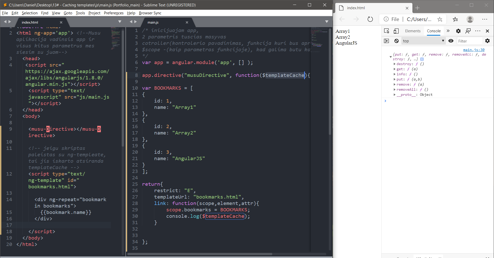
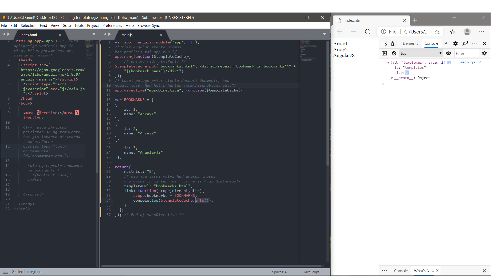

# Caching templates
  
AngularJS allows templates to be cached using a service
$ templateCache. In this example, we will explain how to write
and read templates from $ templateCache.

AngularJS позволяет кешировать шаблоны с помощью сервиса
$templateCache. В этом примере мы разберем как записывать
и читать шаблоны из $templateCache.

# General

### Basic Cache in/using html

### Basic Cache in/using js 

