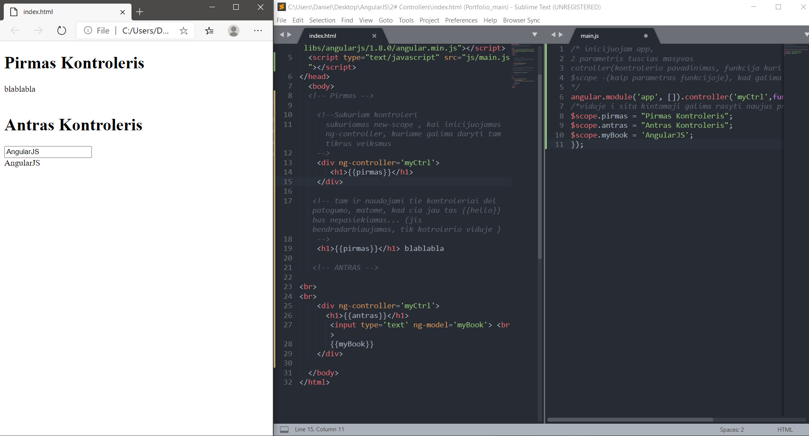

# controllers

## AngularJS controllers control the data of AngularJS applications.
## AngularJS controllers are regular JavaScript Objects.

 -> 
 ```html
<html ng-app='app'>
 ``` 
 - > Это значит, что наше приложение Angular будет называться app и все сущности мы будем привязывать к нему.

Кроме Angular у меня подключен файл main.js.

  <script src="https://ajax.googleapis.com/ajax/libs/angularjs/1.3.5/angular.min.js"></script>
  <script type="text/javascript" src="main.js"></script>
и мы в нем можем инициализировать наш app.

angular.module('app', []);
Теперь, если мы посмотрим в браузер, то у нас пустая страница и ничего нет. 
Все логично, потому что у нас никакого кода не написано.
Если же мы, например, выведем здесь


<body>
  {{1 + 1}}
  <script src="https://ajax.googleapis.com/ajax/libs/angularjs/1.3.5/angular.min.js"></script>
  <script type="text/javascript" src="main.js"></script>
</body>
то у нас в браузере выведется 2.

Что такое контроллер? Когда мы указываем ng-controller то у нас создается новая область видимости. По английски это называется новый scope. Теперь мы можем делать какие-то действия конкретно внутри контроллера.


  
