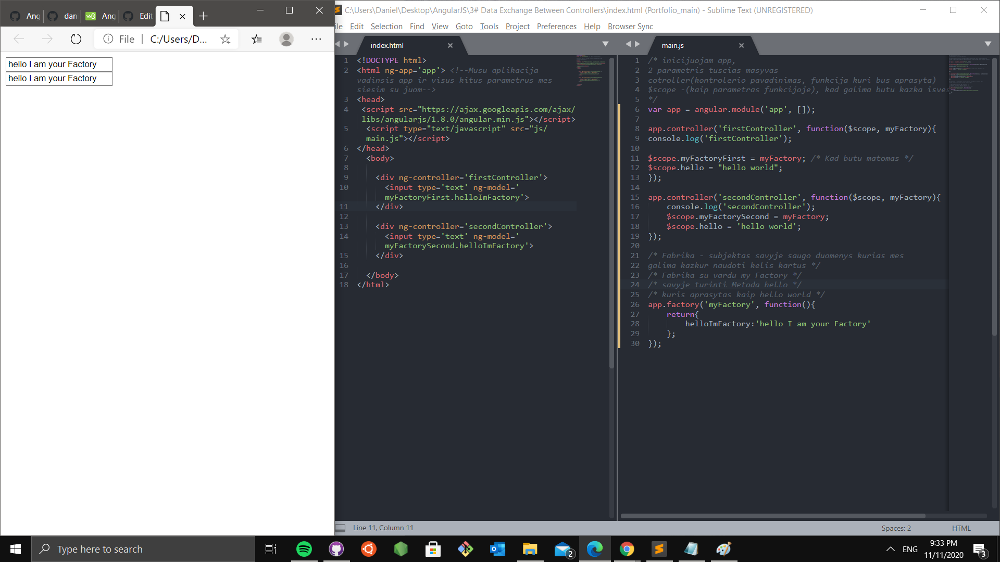

# Date binding
How can controllers communicate with each other?
In this tutorial, i'll take a look at what factories are and how
to store data with them and 
transfer them between AngularJS controllers.

Kartais reikalaujama kai mes darome tam tikra aplikacija,
kad kai kurie panasus duomenys, turetu tokias pat reiksmes.

Как контроллеры могут обмениваться данными между собой?
В этом уроке мы разберем что такое фабрики и как 
с их помощью хранить данные и передавать их между контроллерами
AngularJS.

# General


 ```html

```


# Download
