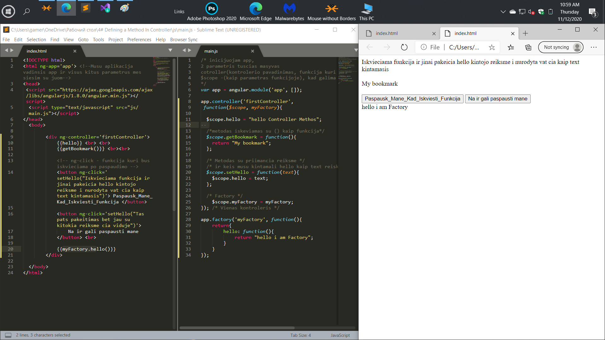

# Defining a Method In Controller

For any single page application, we need methods,
which will be available to us both in the template and in the controller.
In this lesson, we will learn how to describe the method in scoped.
This method will bind the controller to the template and automatically update the data change.

Для любого одностраничного приложения нам понадобятся методы,
которые будут нам доступны как в шаблоне, так и в контроллере. 
В этом уроке мы научимся описывать метод в скоупе. 
Этот метод будет связывать контроллер с шаблоном и автоматически обновлять изменение данных.
AngularJS.

# General


 ```html

{{hello}} <br> <br> <!-- Vat butent sitoj vietoj ir keisis ta reiksme po button paspaudimo (Kur bus kvieciamas metodas) --> 
{{getBookmark()}} <br><br>

<!-- ng-click - funkcija kuri bus iskvieciama po paspaudimo -->  
        	<button ng-click='setHello("Iskvieciama funkcija ir jinai pakeicia hello kintojo reiksme i nurodyta vat cia kaip text kintamasis")'> Paspausk_Mane_Kad_Iskviesti_Funkcija </button>

```

 ```javascript
app.controller('firstController', 
 function($scope ){
 
   $scope.hello = "hello Controller Methos"; /* For Test busimam metodui setHello */
 
  /*metodas iskeviamas html(-e) su () kaip funkcija*/
  $scope.getBookmark = function(){
  	return "My bookmark";
  };

  /* Metodas su priimancia reiksme */
  /* ir keis musu kintamali hello kaip text reiskme */
  $scope.setHello = function(text){
	$scope.hello = text; /* texta sita gausime is ng-click(paspaudimo) ant button */
  };
 
}); /* kontrolerio pabaiga */
```


