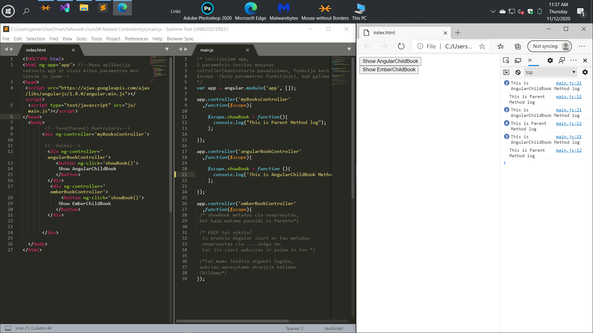

# Nested Controllers

Today we will figure out how to make nested controllers
Why do we need this?
This makes it very easy for us to access the methods of the parent controller from the child.


Сегодня мы с вами разберем как делать nested контроллеры или, по русски, 
вложенные контроллеры. Зачем это нам нужно?
 Это дает нам возможность очень легко получить доступ к методам родительского контроллера из дочернего.

# General


 ```html

<!--Tevo(Parent) Kontroleris-->
       <div ng-controller='myBooksController'>
     
        <!--Vaikai-->
         <div ng-controller='angularBookController'>
            <button ng-click='showBook()'>
             Show AngularChildBook 
            </button> 
         </div>
          <div ng-controller='emberBookController'>
              <button ng-click='showBook()'>
             Show EmberChildBook 
            </button> 
         </div>

```

 ```javascript
app.controller('myBooksController'  /* Tevas */
  ,function($scope){

    $scope.showBook = function(){
      console.log("This is Parent Method log");
    };

});

app.controller('angularBookController' /* Aprasytas Vaikas torintis savyja aprasyta metoda(tas aprasytas metodas bus naudojamas pirmiausiai..)*/
  ,function($scope){

    $scope.showBook = function (){
      console.log('This is AngularChildBook Method log');
    };

});

app.controller('emberBookController' /* Neaprasytas Vaikas*/
  ,function($scope){
 /* showBook metodas cia neaprasytas,
 bet kaip matome paveldi is Parento*/
 
 /* KAIP tai vyksta? 
  Is pradziu Angular ziuri ar tas metodas
  neaprasytas cia ....Jeigu ne.
  tai jis ziuri auksciau ir paima is ten */

 /*Tai mums leidzia atgauti logika,
 aukciau aprasytame atvejyje keliems
 Childams*/
});
 
}); /* kontrolerio pabaiga */
```


