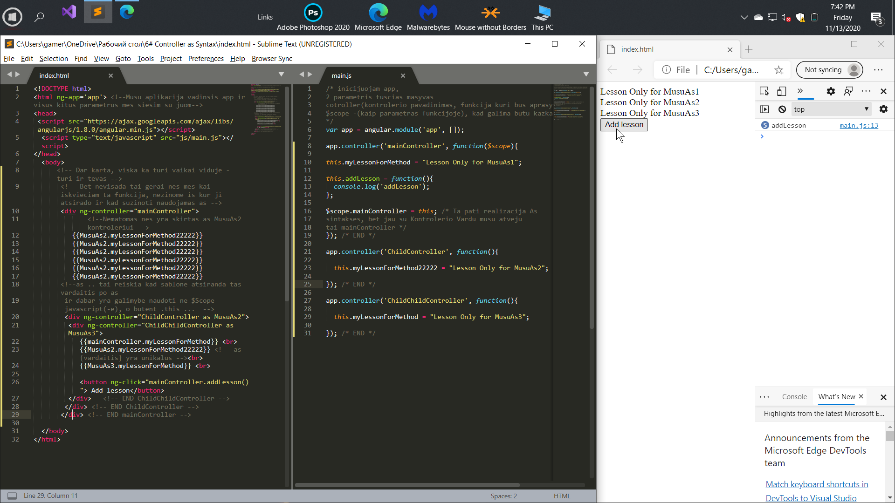

# Controller 'as' Syntax


In the usual AngularJS approach, it is often unclear in the
 template from which controller the method is being called.
 In this tutorial we will break down an alternative approach
 to describing a controller using the this and controller as syntax.

В обычном подходе AngularJS в шаблоне часто непонятно из какого контроллера
 вызывается метод. В этом уроке мы разберем альтернативных подход к описанию
 контроллера используя this и controller as синтаксис.

# General

## Tam Tikros Vietos Paaiškinimas
### Kodo pav. kur mainController nemato, vaiku aprasytus  metodus, naudojant butent as syntax
 ```html

<!--Tevo(Parent) Kontroleris-->
      <div ng-controller="mainController">
          <!--Nematomas nes yra skirtas MusuAs2 ir jo vaikams kontroleriams -->
          {{MusuAs2.myLessonForMethod22222}}
          {{MusuAs2.myLessonForMethod22222}}
          {{MusuAs2.myLessonForMethod22222}}
          {{MusuAs2.myLessonForMethod22222}}
          {{MusuAs2.myLessonForMethod22222}}
          {{MusuAs2.myLessonForMethod22222}}
        
           <div ng-controller="ChildController as MusuAs2">
               <div ng-controller="ChildChildController as MusuAs3">    
               {{MusuAs2.myLessonForMethod22222}} <br>
               </div>   <!-- END ChildChildController -->
              </div> <!-- END ChildController -->
          </div> <!-- END mainController -->
```

 ```javascript
app.controller('ChildController', function(){

  this.myLessonForMethod22222 = "Lesson Only for MusuAs2"; 

}); /* END */
```
### as syntaksees realizavimas JavaScript (-e)
 ```javascript
app.controller('mainController', function($scope){


this.myLessonForMethod = "Lesson Only for MusuAs1";

$scope.mainController = this; 
/* Ta pati realizacija as
sintakses, bet jau bus naudojama su Kontrolerio Vardu musu atveju 
tai mainController */

}); /* END */
```
 ```html
       <div ng-controller="mainController"> 
        <div ng-controller="ChildController as MusuAs2">
         <div ng-controller="ChildChildController as MusuAs3">
            {{mainController.myLessonForMethod}} <br>   <!-- mainController -->
         </div>   <!-- END ChildChildController -->
        </div> <!-- END ChildController -->
       </div> <!-- END mainController -->
   ```    
### Button su ta pati this... as ...
 ```javascript
app.controller('mainController', function($scope){

this.addLesson = function(){
  console.log('addLesson');
}; 

$scope.mainController = this;

}); /* END */
```
 ```html
       <div ng-controller="mainController"> 
        <div ng-controller="ChildController as MusuAs2">
         <div ng-controller="ChildChildController as MusuAs3">
           <button ng-click="mainController.addLesson()"> Add lessonnnnnnnn</button>  <!-- mainController -->
         </div>   <!-- END ChildChildController -->
        </div> <!-- END ChildController -->
       </div> <!-- END mainController -->
   ```   


