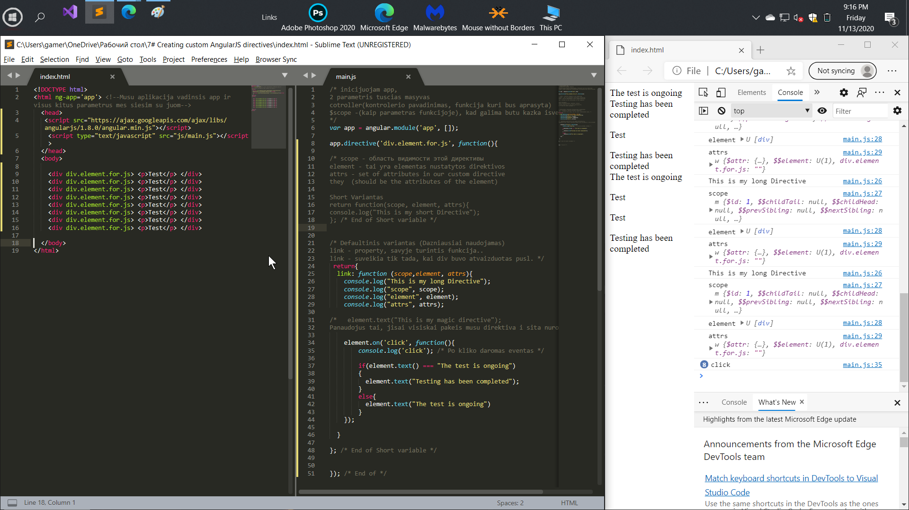

# Custom AngularJS Directives


Directives it's one of AngularJS features.
They allow you to create reusable html elements
with your own logic inside.


Директивы это киллер фича AngularJS.
Они позволяют создавать многоразовые html
елементы с своей собственной логикой внутри.

# General
## Egzistuoja 2 variantai ... 
## 1 - Short ... Mazai kada  vartojamas 

### Cia elementai su kuriais dirbsime elementas vardu div.element.for.js
 ```html
    <div div.element.for.js> <p>Test</p> </div>
    <div div.element.for.js> <p>Test</p> </div>
    <div div.element.for.js> <p>Test</p> </div>
    <div div.element.for.js> <p>Test</p> </div>
    <div div.element.for.js> <p>Test</p> </div>
    <div div.element.for.js> <p>Test</p> </div>
    <div div.element.for.js> <p>Test</p> </div>
    <div div.element.for.js> <p>Test</p> </div>
```

 ```javascript
app.directive('div.element.for.js', function(){

Short Variantas 
return function(scope, element, attrs){

console.log("This is my short Directive");
}; /* End of Short variable */

}); /* End of app.directive('div.element.for.js', function()*/
```
### Vat dabar Defaultinis, dazniausiai naudojamas variantas tie patys html duomenys
 ```javascript

/* 
link - property, savyje turinti funkcija..
link - suveikia tik tada, kai div buvo panaudotas */
 return{
  link: function (scope,element, attrs){
    console.log("This is my long Directive");
    console.log("scope", scope);
    console.log("element", element);
    console.log("attrs", attrs);
  }
}; /* End of Default variable */

```
 ```html
    <div div.element.for.js> <p>Test</p> </div>
    <div div.element.for.js> <p>Test</p> </div>
    <div div.element.for.js> <p>Test</p> </div>
    <div div.element.for.js> <p>Test</p> </div>
    <div div.element.for.js> <p>Test</p> </div>
    <div div.element.for.js> <p>Test</p> </div>
    <div div.element.for.js> <p>Test</p> </div>
    <div div.element.for.js> <p>Test</p> </div>
   ```    
###  Eventas kuris po Paspaudimo elemento dalies ---  bus iskvieciama funkcija:
 ```javascript
 return{
  link: function (scope,element, attrs){
    console.log("This is my long Directive");
    console.log("scope", scope);
    console.log("element", element);
    console.log("attrs", attrs);

/*   element.text("This is my magic directive"); 
Panaudojus tai, jisai visiskai pakeis musu direktiva i sita nurodyta..*/ 

    element.on('click', function(){
        console.log('click'); /* Po kliko daromas eventas */
    
        if(element.text() === "The test is ongoing")
        {
          element.text("Testing has been completed");
        }
        else{
          element.text("The test is ongoing")
        }
    });

  }

}; /* End of Default Variable */
```
 ```html
  <!-- TAS PATS -->
    <div div.element.for.js> <p>Test</p> </div>
    <div div.element.for.js> <p>Test</p> </div>

   ```   


