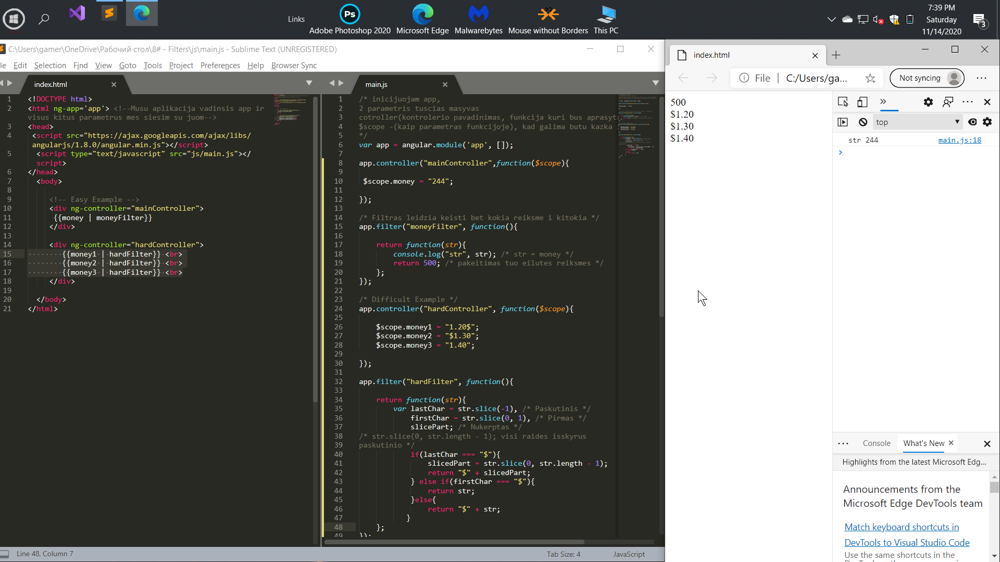

# Custom AngularJS Directives


  
Angular filters are another entity that allows you to manipulate data in output.
 In order to change the format of the output of currency units or add a $ sign, 
it makes no sense to use the controller method. There are filters for this.

Фильтры в ангулар - это еще одна сущность, которая позволяет манипулировать данными при выводе.
Для того, чтобы поменять формат вывода денежных единиц или добавить знак $ не имеет смысла 
использовать метод контроллера. Для этого существуют фильтры.

# General
## Pateiksiu 2 pavyzdzius Lengvesni ir daugiau platesni..
## Lengvesnis

### Cia tiesiog buvusi priskirta kintamajam reiksme 244 , buvo pakeista, su filter funkcijos panaudojimu iki 500.
 ```html
   <!-- Easy Example -->
     <div ng-controller="mainController">
      {{money | moneyFilter}} 
     </div>

```

 ```javascript
app.controller("mainController",function($scope){
 
 $scope.money = "244";

});

/* Filtras leidzia keisti bet kokia reiksme i kitokia */ 
app.filter("moneyFilter", function(){

	return function(str){
		console.log("str", str); /* str = money */
		return 500; /* pakeitimas tuo eilutes reiksmes */
	};
});
```
## Biski platesnis dabar pav.
 ```html

     <div ng-controller="hardController">
        {{money1 | hardFilter}} <br>
        {{money2 | hardFilter}} <br>
        {{money3 | hardFilter}} <br>
     </div>
   ```  
 #### filtras kuriame aprasyta funkcija grazina tam tikra kintamaji : str 
 ```javascript
/* Difficult Example */
app.controller("hardController", function($scope){

	$scope.money1 = "1.20$";
	$scope.money2 = "$1.30";
	$scope.money3 = "1.40";

});

app.filter("hardFilter", function(){

	return function(str){
		var lastChar = str.slice(-1), /* Paskutinis */
			firstChar = str.slice(0, 1), /* Pirmas */
			slicePart; /* Nukerptas */
/* str.slice(0, str.length - 1); visi raides isskyrus
paskutinio */
			if(lastChar === "$"){
				slicedPart = str.slice(0, str.length - 1);
				return "$" + slicedPart;
			} else if(firstChar === "$"){
				return str;
			}else{
				return "$" + str;
		   }
	};
});

```




