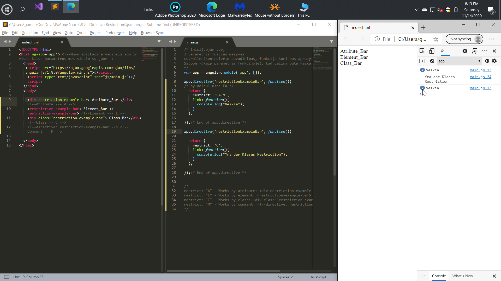

# Custom AngularJS Directives


  
Angular directives can be created using elements, 
attributes, classes and comments.
In this tutorial we will analyze when and what constraints should be used.

Директивы в ангулар могут создаваться с помощью элементов, атрибутов,
классов и комментариев. В этом уроке мы разберем когда и какие
ограничения стоит использовать.

# General


### 4 skirtingi imanomi direktivos aprasymai ir ju kvietai per JavaScripta

 ```javascript
/*
restrict: "A" - Works by atribute: <div restriction-example-bar>...</div>
restrict: "E" - Works by element: <restriction-example-bar>...</restriction-example-bar>
restrict: "C" - Works by class: <div class="restriction-example-bar">...</div>
restrict: "M" - Works by comment: <!--directive: restriction-example-bar -->
*/
```

### Pav Pagal defaulta naudojamas EA...  restrict: 'EACM' yra salyga, pasirinktinai kokiems bus naudojama tam tikra po jos aprasyta funkcija
```html
    <div restriction-example-bar> Atribute_Bar </div> <!--Atribute --- A -->
    <restriction-example-bar> Element_Bar </restriction-example-bar> <!--Element --- E -->
    <div class="restriction-example-bar"> Class_Bar</div><!--Class -- C -->
    <!--directive: restriction-example-bar --> <!--Comment -- M -->
```

 ```javascript
app.directive('restrictionExampleBar', function(){
/* by defaul uses EA */
  return { 
    restrict: 'EACM',
    link: function(){
      console.log("Veikia");
    }
  };
});/* End of app.directive */

app.directive('restrictionExampleBar', function(){
  
  return { 
    restrict: 'C',
    link: function(){
      console.log("Yra dar Klases Restriction");
    }
  };
});/* End of app.directive */  
```




